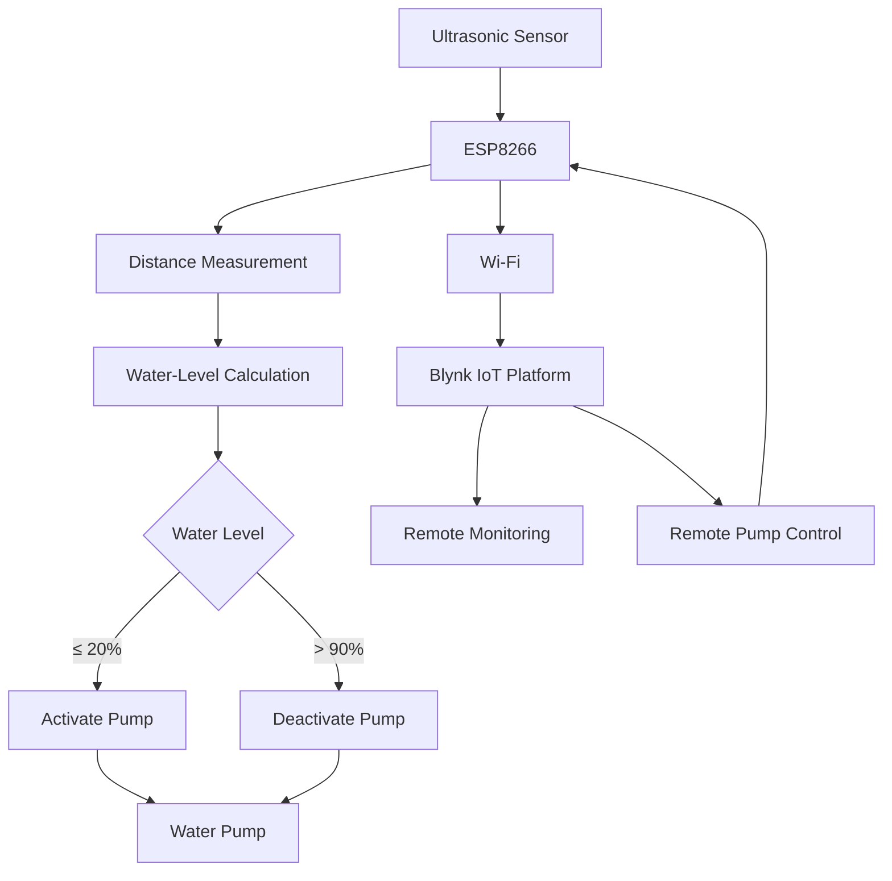

# IoT-Based Water Level Management System

An embedded IoT system for **real-time water-level monitoring and automatic pump control** using an ESP8266, ultrasonic sensing, and the Blynk IoT platform.

The system measures the water level in a reservoir, converts the sensor measurement into a percentage, automatically controls a water pump based on configurable water-level thresholds, and provides remote monitoring through Blynk.

---

## Overview

Water management systems often require reliable monitoring and timely pump control to prevent reservoirs from becoming empty or overflowing.

This project implements a low-cost embedded IoT solution that combines:

* **Ultrasonic sensing** for water-level measurement
* **ESP8266** for sensing, processing, and control
* **Automatic pump control** based on water-level thresholds
* **Wi-Fi connectivity** for remote monitoring
* **Blynk IoT** for visualization and remote pump control
* **Connection-status indicators** for monitoring network availability

The system is designed around a local control loop, with IoT connectivity providing remote visibility and control.

---

## Key Features

* Real-time water-level measurement using an ultrasonic sensor
* Water-level conversion to a percentage scale
* Automatic pump activation when the water level is low
* Automatic pump deactivation when the reservoir reaches the upper threshold
* Remote monitoring through the Blynk IoT platform
* Remote pump control through a Blynk virtual control
* Wi-Fi connection-status indication
* Serial-monitor output for debugging and monitoring
* Configurable reservoir dimensions and control thresholds

---

## System Architecture

The system follows a simple sensing–processing–control–monitoring architecture:



For a detailed description of the system architecture, see:

[`docs/architecture.md`](docs/architecture.md)

---

## How It Works

### 1. Water-Level Measurement

An ultrasonic sensor measures the distance between the sensor and the water surface.

The ESP8266 triggers the ultrasonic sensor and measures the returning echo signal. The measured duration is converted into distance in centimetres.

```text
Distance = Echo Time × Speed of Sound / 2
```

The distance is then mapped to an estimated water-level percentage based on the configured reservoir dimensions.

---

### 2. Water-Level Calculation

The current implementation uses the reservoir height as a calibration parameter.

```text
Reservoir height = 14 cm
Full-level reference = 3 cm
```

The measured distance is mapped to a percentage from 0–100%.

The calibration values can be adjusted to match the physical dimensions of a different reservoir.

---

### 3. Automatic Pump Control

The system uses two water-level thresholds:

|     Water level | System response             |
| --------------: | --------------------------- |
|           ≤ 20% | Pump ON                     |
| > 20% and ≤ 90% | Maintain current pump state |
|           > 90% | Pump OFF                    |

The separation between the activation and deactivation thresholds provides a basic form of hysteresis and helps prevent unnecessary rapid switching of the pump around a single threshold.

---

## IoT Monitoring

The ESP8266 connects to Wi-Fi and communicates with the Blynk IoT platform.

Water-level information is transmitted to Blynk using virtual pins.

| Blynk Virtual Pin | Function                  |
| ----------------- | ------------------------- |
| `V0`              | Remote pump-control input |
| `V1`              | Water-level data          |
| `V2`              | Water-level data          |
| `V0` LED widget   | Pump-state indication     |

The Blynk interface allows the system status to be monitored remotely and provides a mechanism for manually controlling the pump.

---

## Hardware

The current firmware defines the following ESP8266 connections:

| Component                    | ESP8266 Pin | Function          |
| ---------------------------- | ----------- | ----------------- |
| Ultrasonic trigger           | `D2`        | Sensor trigger    |
| Ultrasonic echo              | `D3`        | Sensor echo       |
| Wi-Fi connected indicator    | `D5`        | Connection status |
| Wi-Fi disconnected indicator | `D6`        | Connection status |
| Water pump control           | `D8`        | Pump switching    |

### Main components

* ESP8266 development board
* Ultrasonic water-level sensor
* Water pump
* Pump switching/control circuit
* Water reservoir
* Wi-Fi network
* Blynk IoT platform
* Status indicators

---

## Software and Technologies

* **Arduino C/C++**
* * **Arduino IDE**
* **ESP8266**
* **ESP8266WiFi library**
* **Blynk**
* **Wi-Fi / IoT communication**

---

## Repository Structure

```text
IoT-water-management-system/
│
├── data/
│   └── Experimental and sensor data
│
├── diagrams/
│   └── System architecture and technical diagrams
│
├── docs/
│   └── Detailed project documentation
│
├── images/
│   └── Project and hardware images
│
├── results/
│   └── Experimental results and analysis
│
├── src/
│   └── Embedded system source code
│
└── README.md
```

---

## Getting Started

### Prerequisites

To reproduce the software portion of this project, you will need:

* Arduino IDE
* ESP8266 board support for Arduino
* ESP8266WiFi library
* Blynk library
* An ESP8266 development board
* Compatible ultrasonic sensor
* Appropriate pump-control circuitry
* A Blynk account and configured IoT template

---

## Configuration

Before uploading the firmware, configure the following parameters:

```cpp
#define BLYNK_TEMPLATE_ID "YOUR_TEMPLATE_ID"
#define BLYNK_TEMPLATE_NAME "YOUR_TEMPLATE_NAME"
#define BLYNK_AUTH_TOKEN "YOUR_AUTH_TOKEN"

char ssid[] = "YOUR_WIFI_SSID";
char pass[] = "YOUR_WIFI_PASSWORD";
```

---

## Calibration

The water-level calculation depends on the physical dimensions and installation of the reservoir.

The current implementation defines:

```cpp
float reservoirHeight = 14;
```

and uses a full-level reference of approximately 3 cm in the distance-to-percentage mapping.

For deployment on another reservoir, these parameters should be calibrated experimentally.

A recommended calibration procedure is:

1. Measure the physical distance from the sensor to the bottom of the reservoir.
2. Determine the distance corresponding to the desired full-water level.
3. Record several known water levels.
4. Compare measured sensor distances with actual water levels.
5. Adjust the calibration parameters.
6. Evaluate measurement error across the operating range.

---

## Testing and Evaluation

The project is being developed with experimental evaluation in mind.

Important evaluation metrics include:

* Water-level measurement error
* Sensor repeatability
* Pump response time
* Accuracy of the water-level percentage
* Reliability of Wi-Fi communication
* System response to low and high water-level conditions
* Behavior during network disconnection
* False pump activation/deactivation events

---

## Safety and Reliability Considerations

Because the system controls a physical water pump, the electrical switching circuit should be designed appropriately for the pump being used.

The ESP8266 should not directly drive a pump unless the electrical interface is specifically designed for that purpose.

A suitable switching/driver circuit should be used, with appropriate consideration for:

* Pump voltage and current requirements
* Relay or transistor ratings
* Electrical isolation where required
* Power supply requirements
* Protection against electrical transients
* Water and electrical safety

The automatic control logic should also be evaluated under sensor and communication failure conditions.

---

## Current Limitations

The current implementation uses threshold-based control and ultrasonic distance measurement.

limitations include:

* Ultrasonic measurements can be affected by sensor positioning and environmental conditions.
* Water-level percentage depends on reservoir calibration.
* Wi-Fi connectivity can affect remote monitoring.
* The current control strategy does not predict future water consumption.
* Historical sensor data can be further exploited for advanced analysis.
* Additional fault-detection mechanisms can improve system reliability.

---

## Future Development

The project provides a foundation for further development in embedded systems, IoT, automation, and intelligent monitoring.

Potential improvements include:

### Sensor and control improvements

* Sensor filtering and noise reduction
* Improved calibration
* Sensor timeout detection
* Fault detection
* Pump protection
* Improved network-reconnection handling

### Data and analytics

* Historical water-level logging
* Water-consumption analysis
* Dashboard-based historical visualization
* Anomaly detection
* Water-level forecasting

### Intelligent systems

After collecting sufficient real-world sensor data, machine-learning techniques could be investigated for:

* Water-level prediction
* Abnormal consumption detection
* Sensor anomaly detection
* Predictive pump management

Machine learning is intentionally treated as a future research direction rather than being added without sufficient data.

---

## Project Documentation

Detailed technical documentation is available in:

* [`docs/architecture.md`](docs/architecture.md)
* [`diagrams/`](diagrams/)
* [`results/`](results/)
* [`data/`](data/)
* [`images/`](images/)

---

## Project Status

**Status:** Active development

The current system demonstrates the integration of embedded sensing, automatic physical control, Wi-Fi communication, and IoT monitoring. Further work is focused on experimental evaluation, documentation, reliability, and data-driven improvements.

---

## Author

**Omolayo Seun**

Computer Science graduate with interests in:

* Embedded Systems
* Internet of Things
* Automation
* Intelligent Systems
* Robotics
* Applied Artificial Intelligence

---

## License
