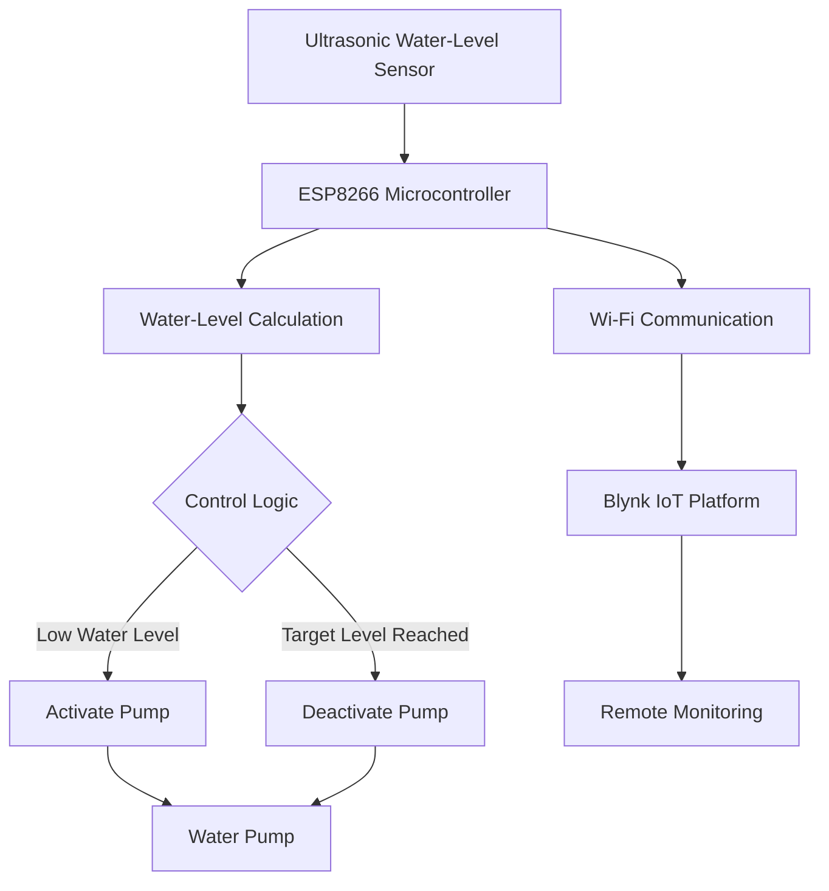
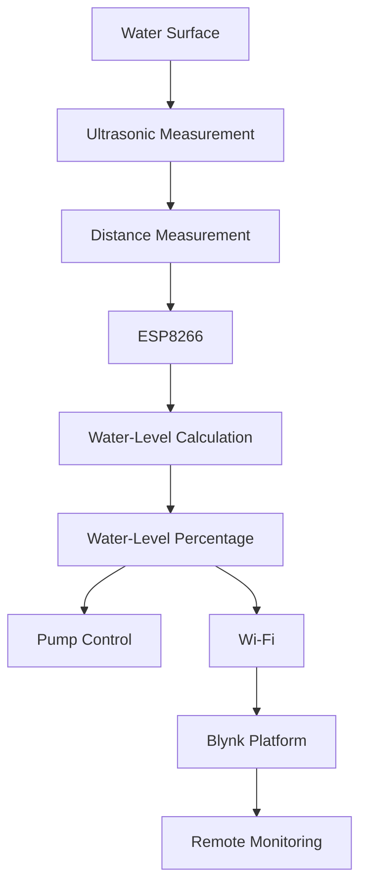

## 1. Overview

The IoT Water Management System is an embedded IoT solution designed to monitor water level and automatically control a water pump.

The system uses an ESP8266 microcontroller to acquire water-level measurements from an ultrasonic sensor, process the measurements, control the pump based on predefined water-level thresholds, and transmit monitoring data to the Blynk IoT platform over internet.

The system provides both automatic pump control and remote monitoring.

## 2. System Architecture

The system consists of four main layers:

1. Sensing layer — measures the water level in the reservoir.
2. Processing and control layer — the ESP8266 processes sensor measurements and executes the pump-control logic.
3. Actuation layer — the pump is switched according to the control logic.
4. IoT monitoring layer — water-level information is transmitted through Wi-Fi to the Blynk platform for remote monitoring.

## 3. Hardware Components

The hardware architecture consists of the following components:

* ESP8266 microcontroller
* Ultrasonic sensor
* 12v DC submersible pump
* IRLZ44N
* Water reservoir
* 12V Power supply
* LED 
* 1N4007 diode
* Vero board
* Rocker switch

The ultrasonic sensor is positioned to measure the distance between the sensor and the water surface. This distance is used to estimate the water level in the reservoir.

## 4. Software Architecture

The firmware is implemented using Arduino C/C++.

The software performs the following major functions:

* Initializes the microcontroller and connected peripherals.
* Establishes Wi-Fi connectivity.
* Measures the distance between the ultrasonic sensor and the water surface.
* Converts the measured distance into an estimated water-level percentage.
* Executes automatic pump-control logic.
* Sends water-level information to the Blynk IoT platform.
* Provides remote monitoring and control functionality through Blynk.

## 5. Data Flow

The data flow through the system is:

## 6. Automatic Control Logic

The system uses water-level thresholds to determine when the pump should operate.

When the measured water level falls below the configured lower threshold, the controller activates the pump.

When the water level reaches the configured upper threshold, the controller deactivates the pump.

The separation between the activation and deactivation thresholds reduces unnecessary rapid switching of the pump.

## 7. IoT Communication

The ESP8266 provides wireless connectivity between the embedded controller and the Blynk IoT platform.

The water-level information can be transmitted to the platform for remote monitoring.

The IoT layer allows the system to provide visibility of the water level without requiring the user to be physically beside the reservoir.

## 8. Fault Handling

The system monitors network connectivity and provides connection-status feedback.

## 9. Design Considerations

The system was designed around the following considerations:

### Local control

Automatic pump control is performed locally on the microcontroller rather than relying entirely on cloud connectivity.

### Threshold-based control

Water-level thresholds provide a simple and interpretable control strategy.

### Remote monitoring

The IoT connection allows the system status to be monitored remotely.

### Calibration

The relationship between ultrasonic distance and water-level percentage depends on the physical dimensions and installation of the reservoir.

## 10. Limitations

The current system has several limitations that provide opportunities for future development:

* Ultrasonic measurements may be affected by sensor positioning and environmental conditions.
* Water-level estimation depends on calibration of the reservoir dimensions.
* Wireless communication depends on network availability.
* Threshold-based control does not currently predict future water consumption.
* The system does not currently use historical data for predictive analysis.

## 11. Future Improvements

Potential future improvements include:

* Improved sensor calibration and filtering.
* Historical water-level data logging.
* Water-consumption analysis.
* Anomaly detection.
* Predictive water-level modelling.
* Improved fault detection.
* Low-power operation.
* Additional sensors for monitoring water quality or pump conditions.
* Integration with machine-learning models after sufficient real-world data has been collected.

## 12. Engineering Evaluation

The system should be evaluated using experimental measurements rather than only functional demonstration.

Potential evaluation metrics include:

* Water-level measurement error
* Sensor repeatability
* Pump response time
* Control accuracy
* Network reconnection time
* System uptime
* False activation/deactivation events
