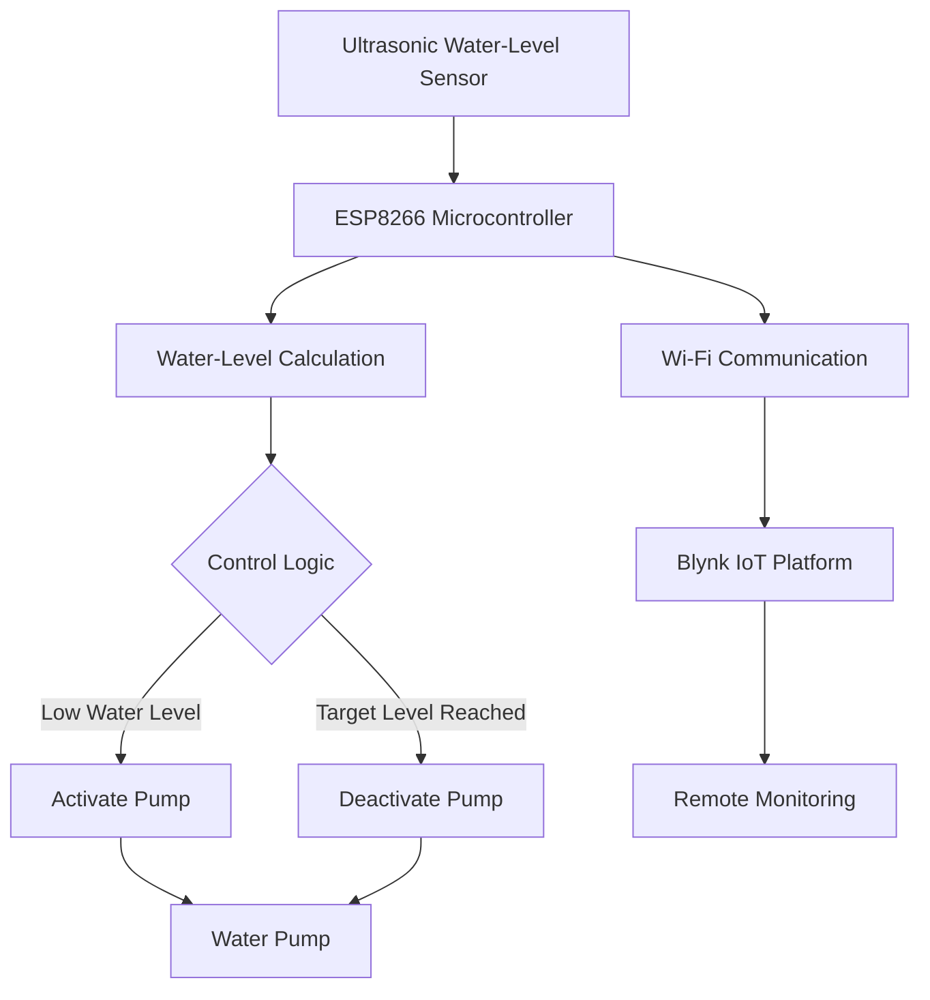

```mermaid
flowchart TD
    A[Ultrasonic Water-Level Sensor] --> B[ESP8266 Microcontroller]

    B --> C[Water-Level Calculation]
    C --> D{Control Logic}

    D -->|Low Water Level| E[Activate Pump]
    D -->|Target Level Reached| F[Deactivate Pump]

    E --> G[Water Pump]
    F --> G

    B --> H[Wi-Fi Communication]
    H --> I[Blynk IoT Platform]
    I --> J[Remote Monitoring]
```
